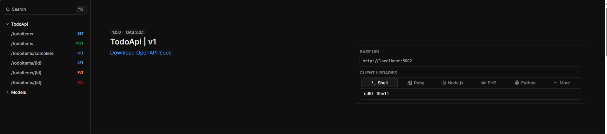

# Todo API

Este projeto é uma API minimalista desenvolvida com C# e .NET 9 preview. A API oferece operações CRUD básicas para gerenciar itens de tarefas (Todo) usando um banco de dados em memória com Entity Framework Core.

## Funcionalidades

- **Adicionar Tarefas**: Adicione novas tarefas à lista de Todo.
- **Listar Tarefas**: Liste todas as tarefas ou apenas as tarefas concluídas.
- **Atualizar Tarefas**: Atualize os detalhes de uma tarefa existente.
- **Deletar Tarefas**: Remova tarefas da lista.

## Pré-requisitos

- .NET 9 preview

## Como Executar

1. Clone este repositório:
    ```bash
       git clone https://github.com/seu-usuario/todo-api.git
       cd todo-api
    ```

2. Restaure as dependências:
    ```bash
    dotnet restore
    ```

3. Execute a aplicação:
    ```bash
    dotnet run
    ```

## Documentação da API
O projeto esta utilizando a ferramenta Scalar (https://scalar.com) para documentação da API, ao rodar o projeto basta acessar a url '/scalar/v1'



## Contribuições

Contribuições são bem-vindas! Sinta-se à vontade para abrir issues e pull requests.

